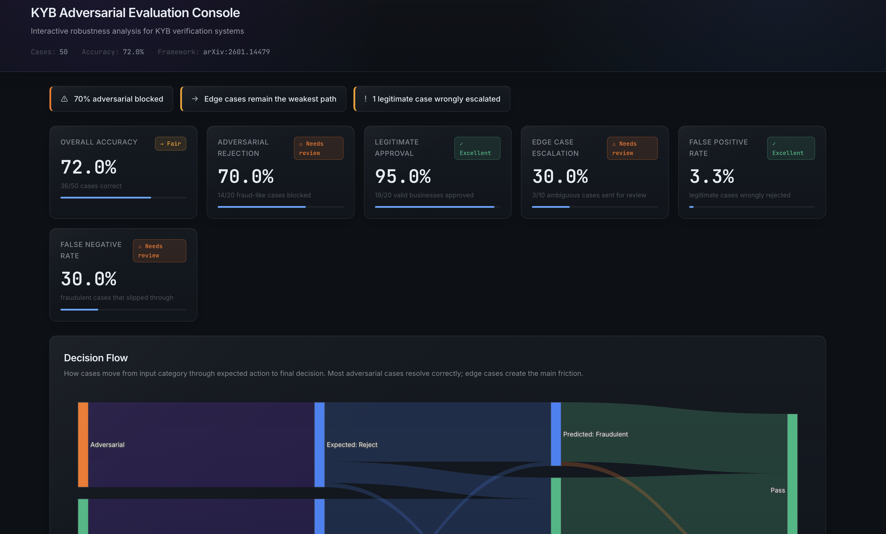

# KYB Adversarial Evaluation Framework

Systematic testing harness for KYB/AML compliance AI, measuring robustness against adversarial attacks, edge cases, and ambiguous scenarios.

**Methodology:** Based on evaluation approach from [arXiv:2601.14479](https://arxiv.org/abs/2601.14479), applied to financial compliance.

---

## The Problem

KYB verification systems must reliably approve legitimate businesses, reject fraud, and escalate ambiguous cases for human review. Failures result in FCA fines, regulatory penalties, and reputational damage.

**Challenge:** Traditional ML metrics (accuracy, F1) don't capture robustness failures, adversarial attacks, data manipulation, and edge cases that production systems encounter daily.

This framework tests decision quality under realistic adversarial pressure.

---

## What's Inside

**50 test cases** across three categories:
- **Legitimate** (20): Active UK companies with consistent documentation
- **Adversarial** (20): Fraudulent submissions with 9 attack patterns (blank docs, address mismatches, name variations, stale documents, dormant companies)
- **Edge cases** (10): Ambiguous scenarios (new incorporations, virtual offices, address changes)

**Two verification approaches:**
- **Rule-based**: Binary decision logic (if/else rules)
- **Scoring-based**: Weighted risk signals (0-100 scale) with tunable thresholds

**Domain-specific metrics:**
- Adversarial rejection rate (% of attacks blocked)
- Legitimate approval rate (% of valid businesses approved)
- Edge-case escalation rate (% sent for human review)
- False positive/negative rates

**Data sources:**
- Real UK company metadata from Companies House API
- Synthetic document representations (utility bills, proof of address)
- Adversarial variants (incomplete, conflicting, or suspicious data)

---

## Interactive Report

**Live demo:** [https://crishN144.github.io/kyb-eval-framework/](https://crishN144.github.io/kyb-eval-framework/)



---

## Quick Start

```bash
# Install dependencies
pip install -r requirements.txt

# Generate test cases
python src/test_generator.py

# Run evaluation (rule-based verifier)
python src/evaluator.py --test-cases data/test_cases.json --output results/evaluation_report.md

# Compare rule-based vs scoring-based verifiers
python src/evaluator.py --compare --test-cases data/test_cases.json --output results/evaluation_report_comparison.md

# Generate interactive console (recommended)
python src/visualizer.py --test-cases data/test_cases.json --output results/kyb_evaluation_console.html
```

Open `results/kyb_evaluation_console.html` in your browser.

---

## Results Summary

**Rule-Based Verifier:**
- Adversarial rejection: 70% (14/20 attacks blocked)
- Legitimate approval: 95% (19/20 businesses approved)
- Edge case escalation: 30% (3/10 cases sent for review)
- False negative rate: 30% (6 fraudulent cases slipped through)

**Key failure modes:**
- Name variation attacks ("Ltd" vs "Limited")
- Stale documents (>12 months old)
- Edge case handling (virtual offices, subsidiaries)

**Comparative analysis** (rule-based vs scoring-based):
- Scoring-based softer on adversarial attacks (55% vs 70%)
- Both achieve 95% legitimate approval and 30% edge case escalation
- Scoring-based uses name normalization ("LIMITED" → "LTD") and graduated document freshness penalties

See `src/evaluator.py` for both verifier implementations.

---

## Technical Approach

**Test generation:**
1. Fetch real UK company profiles from Companies House API. Test suite built on 30 real UK companies (company number, registered address, incorporation date, SIC codes) with synthetic documents layered on top and adversarial variants generated by systematically corrupting fields.
2. Generate synthetic documents (utility bills, incorporation details)
3. Create adversarial variants (blank docs, conflicting addresses, suspicious domains)
4. Design edge cases (recent incorporations, virtual offices)

**Evaluation pipeline:**
1. Define ground truth labels for each case
2. Run verifier(s) to generate predictions (approve/reject/escalate)
3. Compare predictions vs ground truth
4. Categorize failures by attack type
5. Generate actionable insights

**Verification approaches:**
- **Rule-based**: Hard cutoffs (if address mismatch → reject)
- **Scoring-based**: Aggregated risk score with thresholds (reject ≥40, escalate ≥8)

**No external APIs required**  framework tests decision logic, not OCR or LLM capabilities. Test cases are structured JSON, not images.

---

## Project Structure

```
kyb-eval-framework/
├── index.html                       # GitHub Pages entry (redirects to console)
├── data/
│   ├── test_cases.json              # 50 synthetic test cases
│   ├── real_companies.json          # Real UK company data
│   └── adversarial_taxonomy.json    # Attack categories
├── src/
│   ├── test_generator.py            # Test case generation
│   ├── evaluator.py                 # Rule-based + scoring verifiers
│   ├── metrics.py                   # Domain-specific metrics
│   └── visualizer.py                # Interactive HTML console
└── results/
    ├── evaluation_report.md         # Text results
    ├── kyb_evaluation_console.html  # Interactive console
    └── dashboard_preview.png        # Screenshot
```

---

## Limitations

**Text-based only:** Framework uses text representations, not actual document images. Production systems involve OCR, visual layout analysis, and real-time data sources (credit bureaus, sanctions lists).

**Scale:** 50 synthetic cases provide proof-of-concept. Production validation requires hundreds of cases across diverse attack vectors.

**Edge case handling:** 30% escalation rate shows room for improvement in ambiguous case detection.

---

## Future Work

- Threshold sensitivity analysis (precision/recall curves)
- Visual document testing (PDF/image verification with OCR)
- Multi-modal evaluation (text + visual + data source signals)
- Expanded adversarial coverage (GAN-generated documents, deepfakes)
- Production integration (REST API for continuous testing)

---

## Contact

**Crish Nagarkar**
Research Assistant, University of Leeds School of Mathematics

- Email: crishnagarkar@proton.me
- LinkedIn: [linkedin.com/in/crishnagarkar](https://linkedin.com/in/crishnagarkar/)

---

*Demonstrating evaluation methodology for production KYB/AML compliance systems. Open to discussing integration opportunities.*
